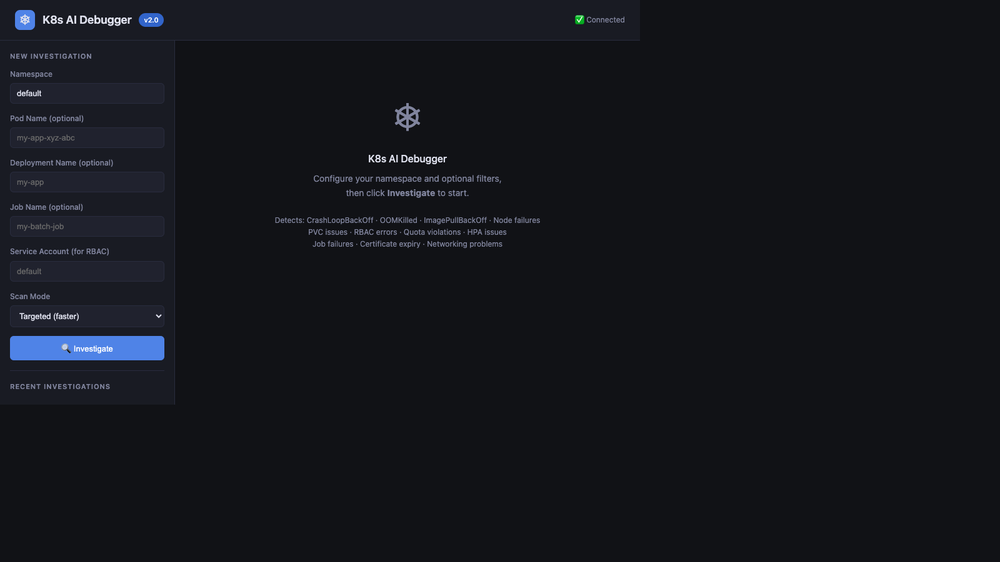
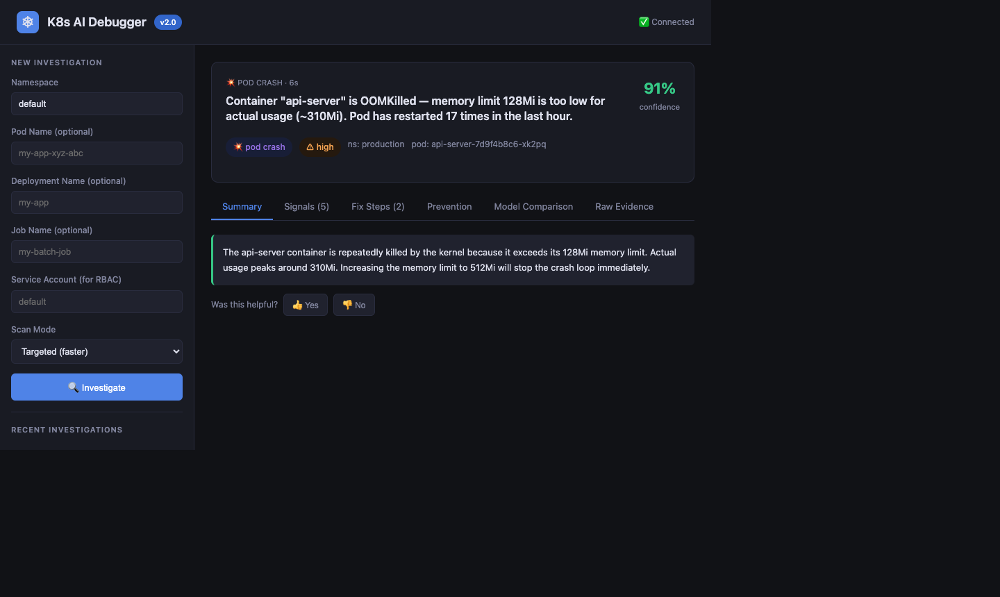
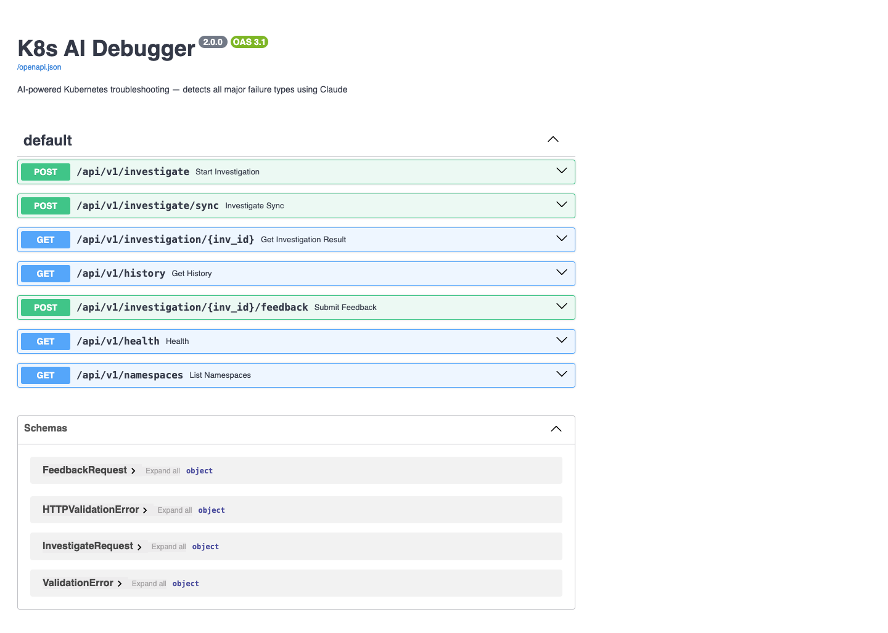

# K8s AI Debugger

AI-powered Kubernetes troubleshooting with actionable fixes.

It inspects cluster evidence (`kubectl` signals, logs, events, rollout state, storage, RBAC, networking, jobs, certs), then produces a root-cause analysis and recommended commands.

## Why this project

- Detects common Kubernetes failure categories in one flow.
- Gives direct, copy-ready fix commands.
- Supports single-model and multi-model AI correlation automatically.
- Includes local broken manifests for end-to-end testing.

## Screenshots

### Dashboard



### Investigation Running



### Interactive API Docs



## Quick start

```bash
git clone https://github.com/premkumar-palanichamy/k8s-ai-debugger.git
cd k8s-ai-debugger
python -m venv .venv
source .venv/bin/activate
pip install -r requirements.txt
touch .env
```

Set at least one API key in `.env`:

```env
ANTHROPIC_API_KEY=your_key_here
# or OPENROUTER_API_KEY=your_key_here
# or GEMINI_API_KEY=your_key_here
```

Run:

```bash
PYTHONPATH=. uvicorn backend.main:app --host 0.0.0.0 --port 8000 --reload
```

Open:

- Dashboard: http://localhost:8000
- API docs: http://localhost:8000/docs

## Common commands

```bash
# Start app
PYTHONPATH=. uvicorn backend.main:app --host 0.0.0.0 --port 8000 --reload

# Sync investigation
curl -X POST http://localhost:8000/api/v1/investigate/sync \
  -H "Content-Type: application/json" \
  -d '{"namespace":"default","scan_mode":"full"}'

# Async investigation
curl -X POST http://localhost:8000/api/v1/investigate \
  -H "Content-Type: application/json" \
  -d '{"namespace":"default","pod_name":"my-app-pod"}'

# Poll result
curl http://localhost:8000/api/v1/investigation/<investigation_id>
```

## LLM configuration

No mode switching needed. Add whichever API keys you have — the app automatically decides:

| Keys configured | What happens |
|---|---|
| 1 key | Runs that model only |
| 2 keys | Runs both in parallel — 2-way correlation |
| 3 keys | Full 3-way correlation — highest confidence |

```env
# Anthropic — direct Claude (console.anthropic.com)
ANTHROPIC_API_KEY=sk-ant-...
ANTHROPIC_MODEL=claude-sonnet-4-6

# OpenRouter — 100+ models via one key (openrouter.ai)
OPENROUTER_API_KEY=sk-or-...
OPENROUTER_MODEL=anthropic/claude-3-haiku

# Google Gemini — direct Gemini (aistudio.google.com)
GEMINI_API_KEY=...
GEMINI_MODEL=gemini-1.5-flash
```

## Multi-model ensemble

When 2 or more API keys are configured, the app automatically runs all models in parallel and correlates their diagnoses:

```
Same kubectl evidence
        ↓
Claude  ──┐
Gemini  ──┼──→ run in parallel → correlate → result
OpenRouter──┘
        ↓
All agree  → HIGH correlation  → confidence +20%
2 agree    → MEDIUM            → confidence +10%
All differ → LOW               → flag for human review
```

The dashboard shows a **Model Comparison** tab with individual model results, category votes, and ensemble confidence score.

## ArgoCD integration

When `ARGOCD_URL` is set, investigations also include ArgoCD app health, sync status, recent deployment history, and unhealthy resources in the GitOps pipeline.

```env
ARGOCD_URL=https://your-argocd-server.example.com
ARGOCD_TOKEN=your_argocd_api_token
```

## Local k8s test scenarios

```bash
cd k8s
chmod +x scripts/*.sh
./scripts/deploy-all.sh
./scripts/status.sh
```

Cleanup:

```bash
cd k8s
./scripts/cleanup.sh
```

## Failure categories covered

- pod crash / restart failures
- image pull failures
- scheduling / pending pods
- node health pressure states
- storage and PVC binding issues
- RBAC access failures
- quota and limit violations
- HPA scaling issues
- job and cronjob failures
- TLS and certificate expiry paths
- networking and endpoint mismatches
- rollout and deployment progression failures
- config and secret reference errors
- ArgoCD sync and GitOps pipeline failures

## Project structure

```
k8s-ai-debugger/
├── backend/
│   ├── main.py               FastAPI entry point (auto-detects kubeconfig)
│   ├── agents/
│   │   ├── investigator.py   evidence gathering + LLM analysis
│   │   └── ensemble.py       multi-model correlation engine
│   ├── api/
│   │   └── routes.py         HTTP endpoints
│   ├── db/
│   │   └── database.py       SQLite persistence
│   └── tools/                kubectl wrappers (one per concern)
│       ├── pod_inspector.py
│       ├── logs_collector.py
│       ├── events_analyzer.py
│       ├── deployment_inspector.py
│       ├── network_inspector.py
│       ├── node_inspector.py
│       ├── storage_inspector.py
│       ├── rbac_inspector.py
│       ├── resource_quota_inspector.py
│       ├── job_inspector.py
│       ├── cert_inspector.py
│       └── argocd_inspector.py
└── frontend/
    └── index.html            self-contained dark mode dashboard
```

## Documentation

- [Quickstart](docs/quickstart.md)
- [Local Kubernetes Testing](docs/testing-local-k8s.md)

## 📝 License

This project is licensed under the terms of the [LICENSE](LICENSE) file.

## 🌐 Connect With Me

🏠 [Portfolio](https://ladviksolutions.netlify.app/)<br>
🐙 [GitHub](https://github.com/premkumar-palanichamy)<br>
💼 [LinkedIn](https://linkedin.com/in/premkumarpalanichamy)<br>
▶️ [YouTube](https://www.youtube.com/channel/UCJKEn6HeAxRNirDMBwFfi3w)
